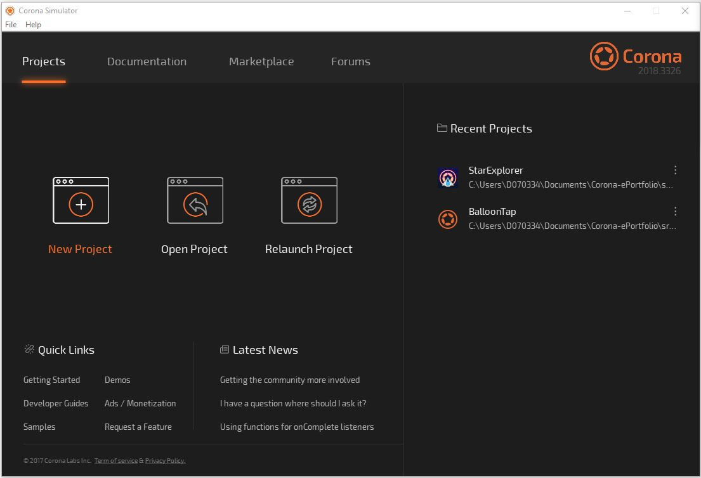
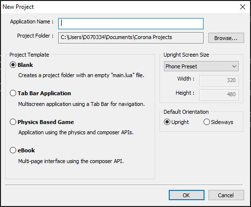

# Installation
This document describes how to install and use Corona.

## Setup
Official website of Corona: https://coronalabs.com/

Register on that website and download the Corona installer from there.

Install Corona on your computer and launch the Corona Simulator.

Now you can develop your apps using an IDE like Visual Studio Code. 

## Use Corona
For developing with Corona, create a new project:

File explorer, the app itself and Visual Studio Code with main.lua are opened automatically.

## Links
Corona Website: https://coronalabs.com/

FAQs: https://coronalabs.com/faq/

Corona Forum: https://forums.coronalabs.com/
